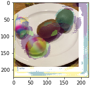
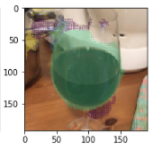

# food-recognition-project
Repo for Deep Learning project

The [Food Recognition challenge](https://www.aicrowd.com/challenges/food-recognition-challenge) is an image segmentation problem aiming to recognize individual food items in each image. 

The [dataset](https://www.aicrowd.com/challenges/food-recognition-challenge/dataset_files) contains:  
 - A training set of 24120 food images, along with their corresponding 39328 annotations in [MS-COCO](https://www.immersivelimit.com/tutorials/create-coco-annotations-from-scratch) format, and comprising proper segmentation, classification, and volume/weights estimates. 
 - A Validation and Test sets of 1269 images. 

 ## Evaluation Criteria
 Given a known ground truth mask A, and a predicted mask B, first compute Intersection Over Union (IoU).
 The prediction is tradionally considered a True detection, when there is at least half an overlap, i.e. IoU >0.5. 
 Then you may define precision and recall. 
 The final scoring parameters are computed by averaging over all the *precision* and *recall*.   
The final scoring parameters are computed by averaging over all the precision and recall values for all known annotations in the ground truth.  

See also this [discussion](https://discourse.aicrowd.com/t/evaluation-criteria/2668).

## Project development
We decide to implement this project by using "One hundre layers Tiramisu", for more details, you may want to read the [report](./Report.pdf)

# Setup 
In order to make be able to run the project jupyter notebook, you should have the data set in the folder containing the script organized in this way:  
├───annotations  
├───images  
│   ├───test  
│   ├───train  
│   └───val  
├─── weights  
├─── script file  
├─── other files  

# Visualization Bug
Due to some Matplotlib dependency, the visualization of the predicted mask may result bugged in local machine, causing that the dimension of the image is different to the dimension of the predicted mask, as the follow:  
  
Meanwhile, on Colab (where the model is trained) the visualization is correct as follow:  
  
